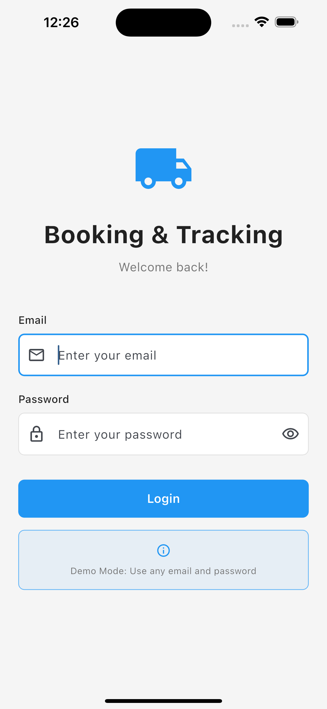

# Screenshots GitHub Par Kaise Dikhaen

## Problem
Screenshots README mein show nahi ho rahe kyunki:
1. Screenshots folder empty hai
2. .gitignore mein screenshots ignore ho rahe the

## Solution

### Step 1: Screenshots Lein

```bash
# App run karo
flutter run

# Screenshots lein:
# - iOS: Cmd + S (Desktop par save hoga)
# - Android: Emulator toolbar se camera icon
```

### Step 2: Screenshots Ko Folder Mein Add Karein

Screenshots ko `screenshots/` folder mein copy karo with these names:

- `login_screen.png`
- `home_screen.png`
- `create_booking.png`
- `location_picker.png`
- `booking_history.png`
- `booking_details.png`
- `live_tracking.png`
- `status_change.png`

### Step 3: Git Mein Add Karein

```bash
# Screenshots add karo
git add screenshots/*.png

# Status check karo
git status

# Commit karo
git commit -m "Add app screenshots"

# Push karo
git push origin main
```

### Step 4: README Update (Optional)

Agar aap placeholder images ko actual screenshots se replace karna chahte ho:

1. Screenshots add karne ke baad
2. README.md mein placeholder URLs ko actual file paths se replace karo:

**Before:**
```markdown

```

**After:**
```markdown

```

## Quick Commands

```bash
# Screenshots check karo
ls screenshots/

# Git mein add karo
git add screenshots/*.png screenshots/*.jpg

# Commit
git commit -m "Add app screenshots"

# Push
git push origin main
```

## Important Notes

1. **File Names**: Screenshots ke names README mein jo hain, wahi use karo
2. **File Format**: PNG ya JPG dono chalega
3. **File Size**: Zyada bada na ho (max 2MB per image)
4. **Quality**: High resolution lein (minimum 1080x1920)

## Current Status

- ✅ .gitignore fixed (screenshots ab add ho sakte hain)
- ✅ README updated (placeholder images add ki)
- ⏳ Screenshots add karni hain (aapko manually karni padegi)

---

**Screenshots add karne ke baad GitHub par automatically dikhengi!**

